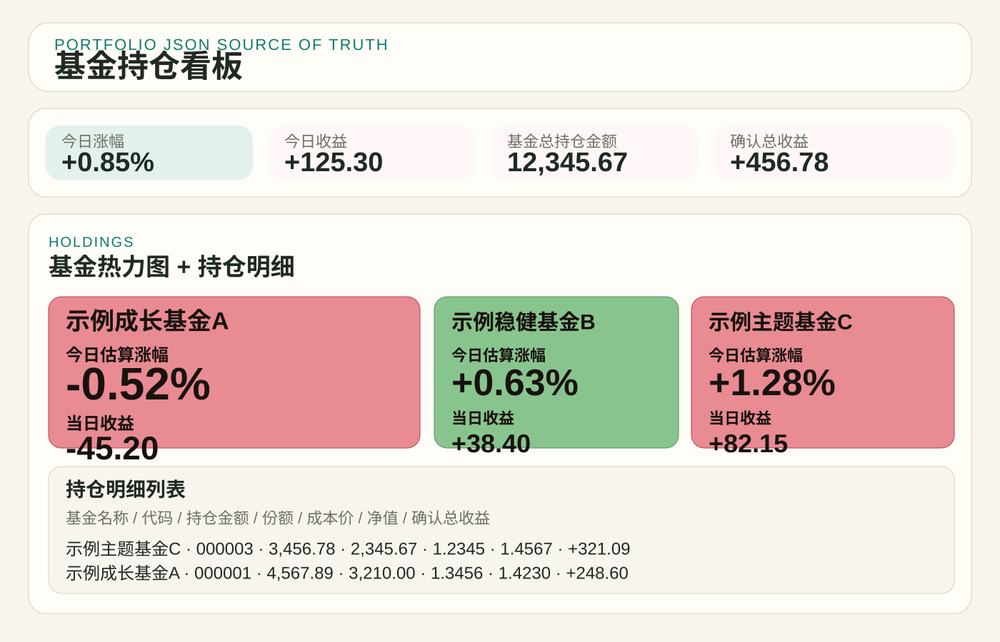
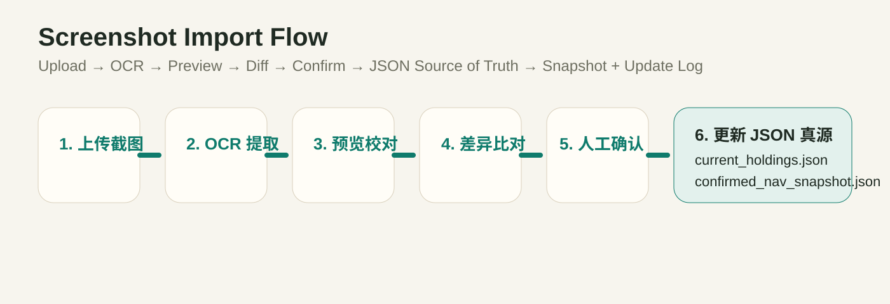

# 持仓看板（Portfolio Dashboard）

> A local-first dashboard for fund investors: import holdings from screenshots, maintain a JSON source of truth, track confirmed NAV-based positions, and monitor intraday estimated profit in real time.


一个面向基金投资者的本地工具：

- 从支付宝 / 养基宝截图导入持仓
- 用 JSON 维护持仓真源
- 自动维护确认净值快照与盘中估算
- 提供适合小屏常驻查看的网页看板
- 让 Agent / 自动化系统和网页统一读取同一份持仓数据

## Why

很多基金平台逐步弱化了盘中收益展示、实时估算和自定义持仓监控能力。
这个项目的目标不是替代券商或基金平台，而是给个人投资者一个：

- 更可控的持仓真源
- 更透明的数据口径
- 更适合自己工作流的本地看板

## Preview

### Dashboard



### Import Flow



## Core Features

- Screenshot import with OCR preview and manual confirmation
- `current_holdings.json` as the base source of truth
- `confirmed_nav_snapshot.json` as the confirmed position baseline
- `realtime_snapshot.json` as the intraday estimate layer
- One dashboard + one agent read path
- Local-first privacy model: real portfolio files stay on your machine

## Data Model

### 1. Base holdings truth

- `portfolio/current_holdings.json`
- Stores fund name, fund code, shares, cost, and imported base holding state

### 2. Confirmed position baseline

- `portfolio/confirmed_nav_snapshot.json`
- Stores the latest confirmed NAV-based market value, holding profit, and holding profit rate

### 3. Intraday estimate layer

- `portfolio/realtime_snapshot.json`
- Stores today's estimated change, estimated daily profit, and realtime overlay state

## Repository Layout

```text
.
├── AGENTS.md
├── README.md
├── LICENSE
├── package.json
├── public/
├── scripts/
├── src/
├── tests/
└── portfolio/
    ├── README.md
    ├── *.example.json
    └── snapshots/
```

## Privacy Model

This public repository ships only with example templates.

Your real local data files are ignored by Git:

- `portfolio/current_holdings.json`
- `portfolio/current_holdings.json.bak.*`
- `portfolio/confirmed_nav_snapshot.json`
- `portfolio/realtime_snapshot.json`
- `portfolio/prev_turnover.json`
- `portfolio/transactions.json`
- `portfolio/fund_sector_map.json`
- `portfolio/update_log.json`
- `portfolio/snapshots/*.json`
- `.run/`

That means:

- GitHub shows project structure and sample schemas
- Your actual holdings stay private on your own machine

## Quick Start

### 1. Requirements

- macOS
- Node.js
- Local `swift + Vision` OCR support

### 2. Clone and bootstrap example data

```bash
git clone https://github.com/maybeemeng747-svg/fund-holdings-dashboard.git
cd fund-holdings-dashboard
npm run bootstrap-data
```

This copies:

- `portfolio/current_holdings.example.json` -> `portfolio/current_holdings.json`
- `portfolio/confirmed_nav_snapshot.example.json` -> `portfolio/confirmed_nav_snapshot.json`
- `portfolio/realtime_snapshot.example.json` -> `portfolio/realtime_snapshot.json`
- and the other example templates into local editable JSON files

### 3. Start the dashboard

```bash
npm start
```

Open:

[http://localhost:3030](http://localhost:3030)

To use an external holdings truth source, set:

```bash
HOLDINGS_FILE="$HOME/.openclaw/workspace/portfolio/holdings.json" npm start
```

### Restore a code backup

The GitHub repository contains code and example data only. Real holdings,
transactions, snapshots, and local data backups are excluded and must be
restored separately from your private storage. Set `HOLDINGS_FILE` to the
restored holdings file before starting the dashboard.

To reinstall the macOS background service using the current Node executable:

```bash
HOLDINGS_FILE="/absolute/path/to/holdings.json" zsh scripts/install-launch-agent.sh
```

Verify `http://localhost:3030/api/holdings` reports the intended `source_file`
and holdings before using the restored dashboard.

## Screenshot Import Workflow

1. Open the local dashboard
2. Click `导入`
3. Upload an Alipay / Yangjibao holdings screenshot and click `提取并预览`
4. Review OCR extraction, missing fields, suspicious fields, and diff
5. Confirm before writing
6. The app updates:
   - `portfolio/current_holdings.json`
   - `portfolio/confirmed_nav_snapshot.json`
   - `portfolio/update_log.json`
   - `portfolio/snapshots/*.json`

## Dashboard Metrics

Top-level dashboard currently shows:

- 今日涨幅
- 今日收益
- 基金总持仓金额
- 确认总收益

Each fund card shows:

- Fund name
- Intraday estimated change
- Daily profit
- Extra status badges such as `已更新` or `黄金夜盘中`

Each fund detail row shows:

- Fund name / code
- Current holding amount
- Shares
- Cost NAV
- Latest NAV
- Confirmed holding profit
- Confirmed holding profit rate
- Portfolio weight

## Agent Read Order

Please refer to:

- [AGENTS.md](./AGENTS.md)
- [.agents/skills/read-current-holdings/SKILL.md](./.agents/skills/read-current-holdings/SKILL.md)

Recommended read order:

1. `portfolio/current_holdings.json`
2. `portfolio/confirmed_nav_snapshot.json`
3. `portfolio/realtime_snapshot.json`
4. `portfolio/fund_sector_map.json`

## Tests

```bash
npm test
```

## Suggested GitHub Topics

You can add these topics on the GitHub repository page:

- `fund-dashboard`
- `portfolio-tracker`
- `json-source-of-truth`
- `ocr`
- `investment-tools`
- `nodejs`
- `local-first`
- `fund-investing`

## Limitations

- OCR depends on macOS Vision and is not cross-platform
- Active mixed funds use estimated intraday proxies, not official realtime NAV
- QDII realtime confidence is lower than domestic A-share funds
- The project is optimized for local personal use, not multi-user cloud deployment

## License

[MIT](./LICENSE)
